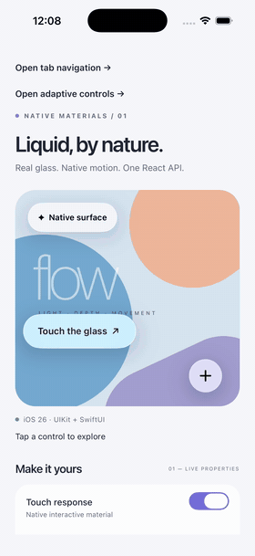
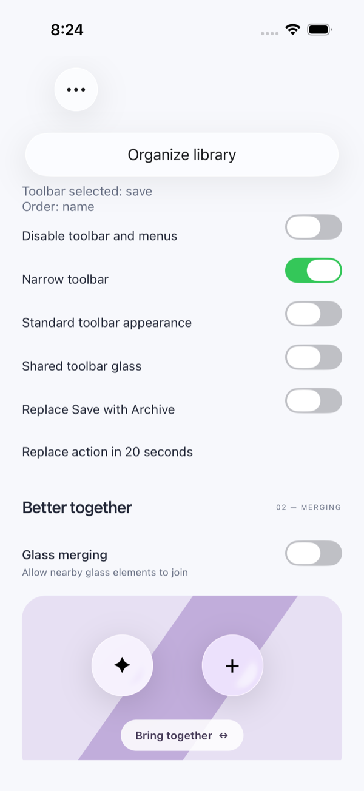
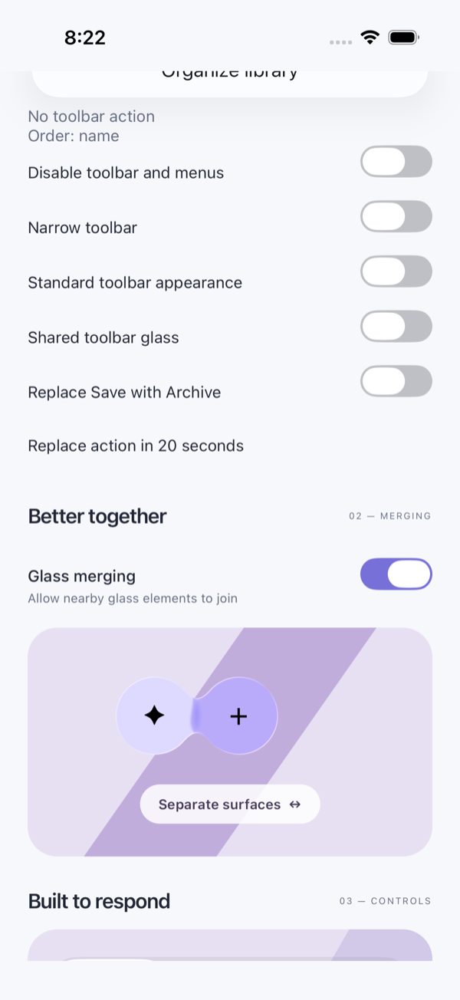
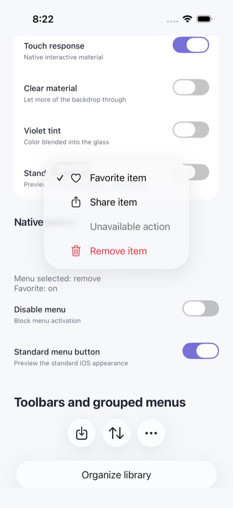
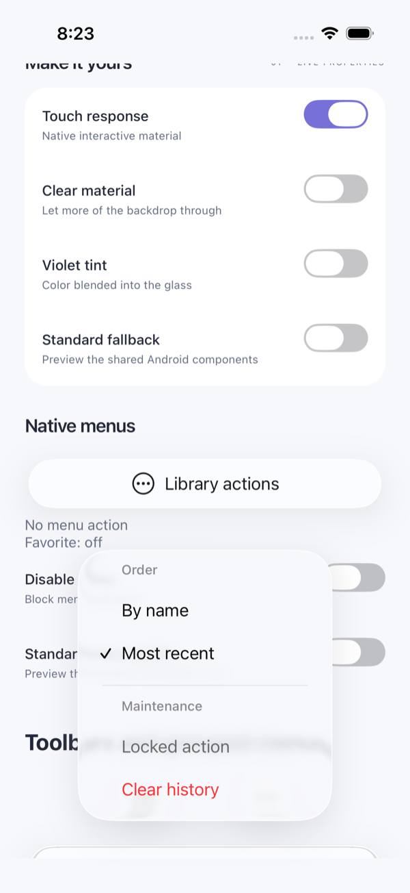

# React Native Adaptive Liquid Glass

A working native prototype: Apple Liquid Glass on iOS 26+, standard controls on Android and older iOS. **No Expo or third-party glass library is required.**

The package is in `packages/liquid-glass`; `example` is a bare React Native demo. It uses React Native 0.86.3, React 19.2.3, Fabric, Swift, UIKit, and SwiftUI. This is an initial implementation, not a completed general-purpose component suite.

For current feature status, remaining work, development batches, and reusable test evidence, start with the [development tracker](.agent/development.md). Contributors should follow [the development workflow](AGENTS.md).

## What it looks like

Captured from the `example` demo on the iOS 26.5 simulator. Every surface below
is a real native view — `UIGlassEffect`, `UIMenu` and `UIToolbar` — not a
JavaScript approximation.

<p align="center">
  
</p>

<p align="center"><sub>Tapping the glass button, expanding the action cluster, and changing the material live — recorded on iOS 26.5.</sub></p>

Glass merging is opt-in. Two nearby surfaces stay separate until you allow them
to join, then the material bridges between them:

<table>
  <tr>
    <td align="center"><br><sub><b>Merging off</b> — independent surfaces</sub></td>
    <td align="center"><br><sub><b>Merging on</b> — the material joins</sub></td>
  </tr>
</table>

Menus are real `UIMenu` presentations, so checked, disabled and destructive
items render and behave exactly as the system draws them:

<table>
  <tr>
    <td align="center"><br><sub><b>Flat menu</b> — disabled and destructive items</sub></td>
    <td align="center"><br><sub><b>Grouped menu</b> — sections and checked state</sub></td>
  </tr>
</table>

On Android and older iOS the same API renders standard platform controls
instead; see [compatibility](docs/compatibility.md).

## Run the demo

```sh
npm install
cd example/ios && pod install && cd ../..
npm start
# In a second terminal:
npm run ios -- --simulator 'iPhone 17 Pro'
# Or, with an Android device/emulator and Android SDK configured:
npm run android
```

Metro uses **8093**, because 8081 was already occupied on this machine. The iOS debug delegate uses localhost in the simulator and the build-generated Mac address on a device; the Mac and phone must share a network. Android's CLI and direct Gradle builds use the same port, configured by `reactNativeDevServerPort` in `example/android/gradle.properties`.

### Build from Xcode

Run `npm run xcode` from the repository root to open **`example/ios/LiquidGlassLab.xcworkspace`**. Select the **LiquidGlassLab** scheme and your iPhone or simulator, then build/run. The workspace includes the Pods project, which builds React Native and AdaptiveLiquidGlass before the app.

Opening `LiquidGlassLab.xcodeproj` directly omits those dependency targets and can produce `AdaptiveLiquidGlass.modulemap not found` or `No such module React`. Close that project window and open the workspace. If dependencies have not been installed, run `npm install` and then `pod install` in `example/ios` first.

Requires Node 22.11+, Xcode 26+, CocoaPods, and a native development build. iOS deployment minimum is 15.1; glass APIs are guarded at iOS 26. Android uses React Native views and ripple feedback for surfaces/buttons, plus Kotlin bridges to SeekBar, popup menus, Toolbar, and Material BottomNavigationView. The package autolinks on both platforms; rebuild both native apps after installation. New Architecture only. The declared React Native range is 0.81–0.86; builds have been checked on 0.81.5 and 0.86.3.

## Use the package

From another React Native app:

```sh
npm install @likith99/react-native-adaptive-liquid-glass
cd ios && pod install
```

Then rebuild the native app; a JS reload will not pick up new native code. The package is published on the public npm registry under the MIT license — no registry credentials are needed to install it.

To test an unreleased change instead, pack the workspace and install the archive, which gives a complete copy without workspace symlinks:

```sh
npm pack --workspace @likith99/react-native-adaptive-liquid-glass --pack-destination artifacts
npm install /absolute/path/to/liquedGlassRecreate/artifacts/likith99-react-native-adaptive-liquid-glass-<version>.tgz
```

See [releasing](docs/releasing.md) for the release process and the gates that still apply.

```tsx
import {useState} from 'react';
import {Text, Platform, PlatformColor} from 'react-native';
import {
  GlassView, GlassButton, GlassContainer, GlassActionCluster,
} from '@likith99/react-native-adaptive-liquid-glass';

const actions = [
  {id: 'save', title: 'Save', systemImage: 'bookmark'},
  {id: 'favorite', title: 'Favorite', systemImage: 'heart'},
];

export function Controls() {
  const [expanded, setExpanded] = useState(false);
  return <>
    <GlassView interactive cornerRadius={24} style={{padding: 20}}>
      <Text style={{color: Platform.OS === 'ios' ? PlatformColor('labelColor') : '#222'}}>
        Any React Native content
      </Text>
    </GlassView>
    <GlassActionCluster
      actions={actions}
      expanded={expanded}
      onExpandedChange={setExpanded}
      onAction={id => console.log(id)}
    />
  </>;
}
```

## Components

| Component | iOS 26+ | Android / older iOS |
| --- | --- | --- |
| `GlassView` | `UIGlassEffect` surface containing real React children; native adaptive material and optional touch response | UIKit system blur on older iOS; opaque themed `View` on Android |
| `GlassContainer` | `UIGlassContainerEffect`; nearby descendant glass surfaces share rendering and merge | Ordinary layout `View` |
| `GlassButton` (title API) | SwiftUI `Button` with `.glass` / `.glassProminent`, loading and disabled states | Standard button with Android ripple |
| `GlassPressable` | Custom React children and press semantics over interactive glass | Ordinary pressable surface, Android ripple |
| `GlassSegmentedControl` | Native `UISegmentedControl`, including the system glass selection thumb | Controlled selectable button group with ripple |
| `GlassMenuButton` | Native glass UIButton and UIMenu with checked, disabled, and destructive actions | Android native Button/PopupMenu; standard UIKit menu button on older iOS |
| `GlassToolbar` | Native UIToolbar with action/menu items, overflow, and optional shared glass backgrounds | Standard Android Toolbar and older-iOS UIToolbar |
| `GlassTabBar` | Contained UITabBarController with native Liquid Glass | Material BottomNavigationView; standard UIKit tab bar on older iOS |
| `GlassSlider` | Native `UISlider`, with system-owned thumb interaction | Android native `SeekBar`; standard `UISlider` on older iOS |
| `GlassActionCluster` | Stable UIKit controls using the same `UIGlassEffect` host as surfaces; opt-in `UIGlassContainerEffect` merging | Buttons showing action titles; same action IDs and callbacks |

See [the typed API](packages/liquid-glass/src/types.ts) and [native architecture notes](docs/architecture.md).

`GlassView` accepts `material` (`regular`, `clear`, `none`), `interactive`, `tintColor`, `cornerRadius`, `colorScheme`, `animationDuration` (seconds), `fallbackStyle`, and `forceFallback`, plus ordinary view props. Use `cornerRadius` to define the native material shape, rather than `style.borderRadius`. Use `PlatformColor('labelColor')` for native semantic labels; the package cannot automatically recolor arbitrary React children.

`GlassContainer.mergingEnabled` defaults to **false**: nearby surfaces remain independent. Set `mergingEnabled={true}` to allow them to join. `GlassContainer.spacing` is the **merging threshold when enabled**, not CSS gap. Place `GlassView` descendants inside it and change their layout or transforms to move them together. Avoid nesting glass surfaces inside other glass surfaces. The demo's position animation uses React Native's native animation driver; UIKit renders the material merging.

`GlassActionCluster` is controlled: update `expanded` in `onExpandedChange`. It accepts typed actions, material, tint, interaction, animation duration, and merging spacing. Its `mergingEnabled` also defaults to false; opt in to shared UIKit glass merging during expansion/collapse. Buttons still expand, respond to touch, and deliver callbacks with merging off. IDs must be unique, nonempty, stable, and must not equal `__toggle`. iOS uses SF Symbols with accessible titles; Android displays those titles. Give the native cluster enough horizontal space: approximately `24 + 52 * (actions.length + 1) + 12 * actions.length` points, and at least 80 points of height. Its native controls do not accept arbitrary React children. The toggle uses the same UIKit material host as GlassView; expansion does not animate its glass opacity or replace its material. Merging uses UIKit geometry and compositing, not SwiftUI matched geometry. The Android fallback can wrap.

`GlassActionCluster` uses the same native interactive material as `GlassView`: UIKit owns finger-localized lighting and deformation, with SF Symbols inside the effect content so they stretch with it. There is no custom press overlay, movement animation, or detached icon. By default, dark-mode actions use a neutral black native material tint at 0.65 alpha to reduce lightness; it darkens the glass **at rest as well as during a press**. Light mode uses a transparent tint, and an explicit `tintColor` overrides this default. This is material tinting, not a 65% highlight-strength setting: UIKit has no separate intensity control ([Apple API](https://developer.apple.com/documentation/uikit/uiglasseffect)). `interactive={false}` disables native press visuals without disabling activation. The former `pressFeedback` prop is deprecated and ignored; the demo has one **Touch response** switch. Android retains its standard ripple response.

The demo’s **Glass merging** switch starts off and controls both the surfaces and action cluster. **Bring together** only moves the surfaces; it does not enable merging.

`forceFallback` is a preview switch on glass surfaces, buttons, the selector, and action clusters, not an inherited context. Set it on both a container and its surfaces to preview the complete standard implementation. `GlassSlider` always uses the platform's native slider and has no `forceFallback` prop. `GlassPressable` adds React press semantics; `GlassView.interactive` changes material response but does not make a view a semantic button.

## Native button and segmented control

```tsx
const [filter, setFilter] = useState<string | null>('all');

<GlassButton
  title="Add to collection"
  systemImage="plus"
  variant="prominent"
  loading={saving}
  disabled={!canSave}
  onPress={save}
/>
<GlassSegmentedControl
  options={[
    {value: 'all', label: 'All'},
    {value: 'saved', label: 'Saved'},
    {value: 'shared', label: 'Shared', disabled: true},
  ]}
  value={filter}
  onValueChange={setFilter}
  accessibilityLabel="Library filter"
/>
```

Import `GlassSegmentedControl` from the package with the other components. The native button accepts a text `title`, optional iOS SF Symbol (`systemImage`), `variant` (`regular` or `prominent`), `disabled`, `loading`, `tintColor`, `colorScheme`, `forceFallback`, and an argument-free `onPress`. Android retains the title and ignores the iOS-only symbol. Loading disables activation and announces its state. The native button uses the system's built-in styles rather than a custom glass material modifier; `material`, `cornerRadius`, and React `contentStyle` belong to `GlassPressable` instead.

The selector is controlled: update `value` in `onValueChange`. `null` clears selection. Option values must be unique and nonempty, labels must be nonempty, and a non-null selected value must exist in the options. Options can be replaced/reordered. Both individual options and the entire control support `disabled`. Re-selecting the same value does not emit another callback. The native selector restores the controlled selection if the callback declines the change. `tintColor` sets the native selected-segment tint; omit it for Apple's default material. At standard text sizes, native layout uses equal widths and a 44-point control within the default 52-point host. Options stay side by side at every text size; above a system font scale of 1.3 both platforms use the React group, whose labels wrap instead of truncating, so a long label makes the control taller. Short labels and a small number of options work best.

The title button defaults to a 64-point host at standard text sizes. Native button/menu/toolbar/tab host heights grow by one line height per unit of system font scale, because only their text scales; explicit `style.height` overrides this. Set an explicit width/flex in horizontal rows. Both controls accept `style` for their React layout bounds; they do not size Yoga from their native intrinsic content. Allow vertical space for adaptive controls; fixed parent heights can still clip content. Neither participates in shared glass merging or introduces a merging group. The segmented thumb's normal selection movement is system control behavior, separate from neighboring surfaces merging.

Existing `<GlassButton><Text>...</Text></GlassButton>` calls continue to use the custom-children implementation. Prefer its explicit name, `GlassPressable`, in new code. This preserves the original API while making the native ownership boundary clear.

## Native menus

`GlassMenuButton` adds a native menu trigger with stable action IDs, controlled checkmarks, disabled and destructive items, sections, one submenu level, and native dismissal. Android uses its system popup menu. See [menu usage and behavior](docs/menus.md).

`GlassToolbar` places actions and menus in a native toolbar, with automatic overflow and an optional visible-item cap. Shared glass backgrounds default off. See [toolbar usage, layout, and platform behavior](docs/toolbars.md).

## Native tab navigation

`GlassTabBar` provides controlled native tabs with icons, numeric/dot badges, disabled items, and reselection. The demo includes a React Navigation adapter; the package itself needs no navigation library. See [tab API, safe areas, and integration](docs/tabs.md).

## Native slider

```tsx
import {GlassSlider} from '@likith99/react-native-adaptive-liquid-glass';

const [level, setLevel] = useState(40);

<GlassSlider
  value={level}
  minimumValue={0}
  maximumValue={100}
  step={10}
  onValueChange={setLevel}
  onSlidingComplete={value => console.log('Released at', value)}
  onSlidingCancel={value => console.log('Cancelled; controlled value', value)}
  accessibilityLabel="Level"
/>
```

Defaults: range 0–1, continuous movement (`step={0}`), and a 52-point host. Set `disabled` to block changes and `tintColor` to customize the active track. The native control owns the thumb while dragging; React updates the controlled `value` through `onValueChange`. After release or cancellation it reconciles with the latest React value, including when a parent declines a change. Programmatic changes made during a drag take effect when tracking ends. `onSlidingStart` and `onSlidingComplete` report the gesture's values; `onSlidingCancel` reports the restored controlled value. Cancellation also occurs if the control is disabled, its range/step changes during a drag, or it detaches. Cancellation is separate from completion and does not roll back values the parent already accepted.

Values clamp to the range and positive steps snap relative to `minimumValue`. The maximum remains reachable even when the step does not divide the range. Inputs must be finite, maximum must exceed minimum, and step must be between zero and the range. This is a UI control, not an arbitrary-precision numeric input: iOS uses a normalized Float and Android uses one million progress ticks. Accessibility adjustment uses the configured step, or 5% of the range for continuous sliders. Supply an accessible label; allow enough height for comfortable interaction.

The demo's **Stay in motion** section lets you switch stepping and disable the slider. **Lock value** demonstrates a rejected change returning the thumb to React's value. The slider introduces no shared merging group. Apple's native slider supplies its own thumb response; the package does not expose tick marks or neutral-track styles yet. See Apple's [UIKit design session](https://developer.apple.com/videos/play/wwdc2025/284/) for the system behavior.

## Accessibility and boundaries

Reduce Transparency replaces the surface and action-cluster glass with opaque semantic backgrounds. Reduce Motion disables custom material/expansion transitions; the demo also disables its positional spring. UIKit supplies action-cluster accessibility; the title button uses SwiftUI semantics and React fallbacks supply React Native semantics. Runtime accessibility settings are observed by UIKit/SwiftUI. See [accessibility and adaptive layout](docs/accessibility.md) for sizing, semantics, and the verification boundary.

The system owns optical adaptation and interactive deformation. No private Apple APIs or approximated blur shaders are used. This does **not** expose every effect visible in Apple's own apps. Arbitrary React-tree morphing, custom drag/stretch physics, automatic scroll-driven tab minimization, submenus within submenus, per-corner shapes, and old-architecture support are not implemented yet. Physical-device performance, older iOS runtime coverage, VoiceOver/Dynamic Type, and broad React Native version compatibility still need dedicated validation.

## Checks

```sh
npm run typecheck
npm test
xcodebuild -workspace example/ios/LiquidGlassLab.xcworkspace \
  -scheme LiquidGlassLab -destination 'platform=iOS Simulator,name=iPhone 17 Pro' \
  -derivedDataPath artifacts/DerivedData CODE_SIGNING_ALLOWED=NO test
```

Metro must be running for the Debug UI tests. They exercise glass/action callbacks, opt-in merging, native buttons and segmented selection, and slider snapping, rejected changes, reset, and disablement. Screenshots are attached to Xcode's test result. See [verification notes](.agent/verification.md) for actual run results.

`python3 scripts/verify-android-slider.py` checks the slider in a running Android demo using adb and saves screenshots/results under `artifacts`. It defaults to `emulator-5554`; override `ANDROID_SERIAL` and `ADB` as needed. This drives the demo UI, so leave that emulator idle during the test.

`python3 scripts/verify-android-toolbar.py` checks the toolbar/menu batch, including the existing flat-menu regression. Start from a freshly launched demo. The corresponding iOS test is `GlassInteractionTests/testToolbarAndMenuBatch` and includes both the flat-menu regression and toolbar/hierarchy scenarios. These focused batch checks avoid rerunning unrelated surface/slider tests.

`python3 scripts/verify-android-tabs.py` exercises the native tab navigation demo. The corresponding iOS test is `GlassInteractionTests/testNativeTabNavigationBatch`. These checks cover rejected selection, reselection, retained screen state, disabled tabs, programmatic navigation, reordering, replacement, badges, and remounting; Android also checks back history.

`python3 scripts/verify-android-accessibility.py` exercises button/loading/disabled states, controlled selectors, action groups, large text, themes, in the adaptive lab (RTL remains manual). It restores emulator settings in a `finally` block. iOS counterparts are `testAdaptiveControlAccessibility` and `testAdaptiveLargeText`. These inspect semantics and layout; they do not verify spoken screen-reader output.

`node scripts/verify-package.mjs` packs the library, installs it in a separate temporary app with its own dependencies, checks TypeScript and autolinking, produces both JS bundles, and compiles both native apps. It requires network access, CocoaPods/Xcode, and configured `ANDROID_HOME`/`JAVA_HOME`. Set `ALG_CONSUMER_DIR` to an existing `/private/tmp/alg-consumer-*` directory to reuse its native build caches; the archive uses a content-specific install path. The standalone sample intentionally omits React Navigation and react-native-screens. It leaves the temporary consumer and artifacts for inspection and does not publish anything.

## Reference study

The requested reference packages are installed only under `research/references/node_modules`, with their own lockfile. They are not dependencies of our package or demo. Restore with `npm ci --prefix research/references --ignore-scripts --legacy-peer-deps`. See [research notes](.agent/research.md) for versions, sources, findings, and implementation limits.
