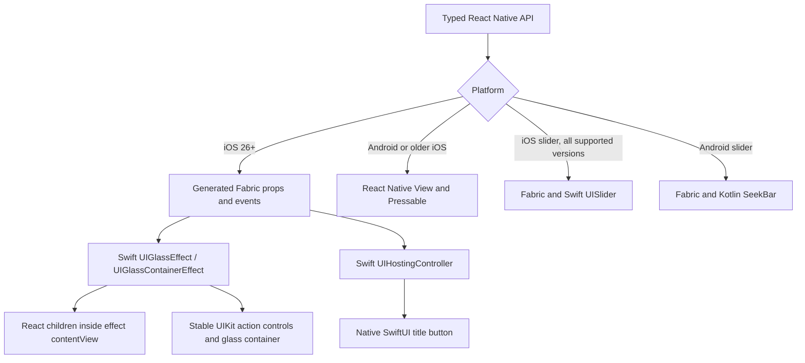

# Native architecture

The Objective-C++ files implement Fabric component descriptors and convert generated props into Swift values. Native action events use Fabric's generated event emitter. JavaScript runs no per-frame morphing work: expanded-state changes initiate a native UIKit animation in the action cluster. The merging demo uses React Native's native driver to move sibling surfaces.

## Material host

`ALGSurfaceView` owns one `UIVisualEffectView`. React children mount into its `contentView`, preserving UIKit's material compositing. Initial material creation is deferred until nonempty layout in a window. Reattachment resets that state; interactivity changes tear down the old effect before recreating it. A notification observer handles Reduce Transparency changes, and native transitions consult Reduce Motion.

The Fabric wrapper restores the full bounds for the material after Fabric's default content layout. Yoga already supplies padding offsets to children; using Fabric's inset content frame would shrink the material and count padding twice. Native view recycling is disabled in this initial version to avoid retaining stale host state across different React nodes.

The uniform `cornerRadius` prop is independent of React Native's border styling. Container mode places a `UIGlassContainerEffect` behind the mounted descendants only when `mergingEnabled` is true (default false). Disabling it replaces the container effect with an empty visual effect while keeping React children mounted and their individual glass materials intact. Material effect views must remain in the same UIKit subtree for compositing.

## Action cluster

`ALGActionClusterView` uses the same `ALGSurfaceView` material host as `GlassView`. Each item is a plain UIView with an SF Symbol directly inside the effect content view. UIKit owns hit testing, finger-localized lighting, and deformation of the glass and glyph together. There is no UIControl inside the glass, forced hit-test return, detached foreground icon, contrast shadow, custom press overlay, or press transform. A UITapGestureRecognizer on the item observes activation with cancelsTouchesInView, delaysTouchesBegan, and delaysTouchesEnded all false. Items provide button accessibility traits and activation, while disabled actions disable their recognizer and native interactivity. The host's ordinary circular hit boundary is stationary; actual touch targeting passes through UIKit's normal glass hierarchy.

The toggle's material, bounds, and opacity remain unchanged during expansion and action callbacks. Only its plus glyph rotates into a cross. Unchanged material/tint/interaction props do not reconfigure effects. Action instances are retained by stable IDs; collapsed actions detach after their transition so they cannot remain in the accessibility hierarchy. Expansion is controlled by React. Interruptible UIKit animations use the current presentation state, and Reduce Motion skips those transitions.

With `mergingEnabled=false` (the default), action surfaces fade at their own separate positions, while the pressed toggle retains its own native release response. With merging enabled, UIGlassContainerEffect combines the child materials as the controls move from/to the toggle position. This preserves native merging through animated UIKit geometry; it no longer uses SwiftUI namespaces, glassEffectID, or matched-geometry transitions. No private effects or custom blur shader are used. UIKit exposes no numeric native highlight-strength setting. The former restrained-feedback implementation has been removed, and `pressFeedback` is retained only as a deprecated, ignored TypeScript prop for source compatibility. The native bridge no longer accepts it. `interactive` controls the native effect for all enabled action controls. Presses and unchanged props never replace the material; only explicit appearance/interaction changes reconfigure it. A dynamic native UIColor tint defaults to black at 0.65 alpha in dark mode and clear in light mode. It changes the complete material appearance, including rest and pressed lightness, without creating a separate press effect. Explicit caller tint wins. Readability must still be judged on the physical display.

Actions are serialized as JSON at the component boundary, validated by the public typed API, and decoded only when JSON changes. Fabric carries ID/expanded events back to React. Android counterparts and the public React API are unchanged. The independent title-based GlassButton still uses SwiftUI's built-in button styles.

## Android

Metro selects the TSX counterparts for surfaces, buttons, the selector, and action clusters. Their native specs exclude Android. The slider uses a cross-platform Fabric spec and a Kotlin SeekBar bridge: `AdaptiveLiquidGlassPackage` registers `ALGSliderManager`, with generated manager props and direct events. Android autolinking is enabled and registers slider, menu, and tab component descriptors. Consumers must rebuild Android after installation. No Expo or separate slider dependency is required.

## Next extensions

The [development tracker](development.md) owns priorities, batch scope, and remaining validation. The tab navigation batch adds an independent native host and a demo-only router adapter; release preparation follows.

Potential cross-element SwiftUI morphing would need a declarative native scene/slot contract. Moving arbitrary Fabric children into independent SwiftUI hosts does not automatically provide shared identity/layout. This remains optional research; custom gesture physics is not planned. Do not promise an undocumented Apple stretch control.

## Standalone native controls

`ALGButtonView` hosts a SwiftUI Button with the public `.glass` or `.glassProminent` primitive button style. SwiftUI owns touch handling, disabled semantics, the SF Symbol/title label, and loading content. The Fabric bridge emits a dedicated activation event; both native and JavaScript code reject activation while loading or disabled. Reduce Transparency selects native bordered styles. UIKit/SwiftUI own the system animation behavior. The existing custom React-content implementation is exported as GlassPressable; GlassButton dispatches legacy children calls to it for compatibility.

`ALGSegmentedView` wraps UISegmentedControl directly, rather than layering another glass surface on top of Apple's native selected thumb. React values map to native segment indices. The Swift view rebuilds segments only when options change, applies per-option enabled flags, and restores the controlled index before dispatching a new value to React. This keeps a rejected change from silently persisting in native state. The JS layer validates values and ignores disabled or duplicate callbacks. Android's counterpart uses accessible selectable Pressables with the same controlled contract.

## Slider ownership and events

`ALGSliderView` wraps UISlider on all supported iOS versions and SeekBar on Android. UIKit supplies the current platform appearance and interaction without another glass surface around the thumb. iOS normalizes the public Double range to a 0–1 Float; Android maps it to one million integer progress positions. Both clamp/snap relative to the minimum and keep the maximum endpoint reachable. Tiny steps below native track precision are not guaranteed to be individually reachable by dragging.

The native control owns thumb tracking. Incoming React values are retained during a drag and applied when it ends; continuous tracking does not repeatedly reposition the native thumb from JavaScript. Start, change, complete, and cancel are separate direct events. The JS wrapper increments an internal revision on complete/cancel so Fabric sends a prop transaction even when the parent rejects a change and its controlled value remains identical. This restores the thumb to React's value after release. Android gesture tracking also requests that its parent not intercept the horizontal drag.

Disabling, changing the range/step, detaching, and native gesture cancellation end tracking with cancellation. This restores the latest controlled value, not necessarily the initial drag value, because React may have accepted intermediate changes. Programmatic prop updates do not emit user value-change callbacks. Native accessibility adjustment uses a positive step or 5% of the range and follows the same start/change/complete contract. The host exposes the inner native control to accessibility; `disabled` supplies its enabled state. These controls do not enable neighboring glass merging.

The UI-test runner compiles the production UIKit hosts and compares action interactivity with a reference ALGSurfaceView and verifies dark/light default tint resolution plus caller overrides. It checks that glyphs remain inside native effect content, touches enter the glass hierarchy, unchanged props preserve the effect, and interaction toggles/activation work. Real app UI tests cover presses, cancellation, repeated activation, and opt-in merging. These tests do not establish identical perceived brightness across differently sized glass shapes.

## Menu ownership

GlassMenuButton passes validated JSON items and direct ID events through Fabric. iOS owns a UIButton with UIMenu/UIAction entries; native glass configuration is guarded at iOS 26, with a tinted standard configuration for older iOS, Reduce Transparency, or forceFallback. Android owns a Button and PopupMenu. Each host tracks an item revision, dismisses on replacement/disable/detachment, and validates native selections against its current item list. React additionally rejects disabled and unknown IDs. Checkmarks remain controlled; selection never mutates the public items. No custom glass press effect or menu animation is introduced. See [menu API](menus.md).

`GlassToolbar` reuses the `ALGMenu` Fabric transport with a toolbar mode, visible-item limit, and opt-in shared-background prop. It exposes a separate typed API while sharing tree validation, action identity, and platform menu construction. Native toolbar mode hosts UIToolbar or Android Toolbar, rather than wrapping a row of React buttons in another material. Sections render as inline UIMenus on iOS and native groups/title rows on Android. The public tree allows one submenu level to match Android's documented contract.

Both toolbar hosts budget actions against their React frame and move excess items to native overflow menus. UIKit estimates title/SF Symbol widths and sets native bar items; Android bounds action candidates before letting its native presenter lay them out. Android recalculates after the host's layout establishes its width and explicitly measures native children following Fabric updates. Neither host animates press feedback in JavaScript. Shared iOS bar backgrounds are off by default; this uses UIBarButtonItem.sharesBackground and is separate from UIGlassContainerEffect proximity merging. See [toolbar API](toolbars.md).

## Tab navigation ownership

`GlassTabBar` validates destinations and sends JSON, a controlled ID, and a reconciliation revision through the cross-platform ALGTabs Fabric component. iOS contains a UITabBarController in the nearest owning view controller and retains destination controllers by stable ID. On iOS 18.4+ it configures UITab directly, including its native enabled state; older versions use UITabBarItem and the classic controller delegates. It detaches containment when removed from the window. UIKit owns the actual tab bar, Liquid Glass, and selection feedback; React owns the screen content above the bounded native host. The controller stays in compact tab-bar mode and does not minimize on scroll.

Android owns Material BottomNavigationView, with library vector presets and optional app drawable overrides. Stable public IDs map to native menu IDs. Badge/title/disabled metadata updates keep existing menu items so the native selection indicator retains its layout; only destination ID/order changes rebuild the menu. Native Material owns the indicator/ripple and badges; React owns external safe-area padding. Configuration changes re-resolve the native theme. Menu changes receive a posted native measurement, avoiding unmeasured children after Fabric updates.

A native tap provisionally selects its destination, emits a non-coalescing ID event, and reconciles with the next React transaction. The JS revision forces that transaction even when the parent rejects the request. Native and JS guards reject disabled, detached, removed, or stale selections. Programmatic selection sets the native selection directly without emitting a tap. The demo adapter maps route keys to IDs and emits React Navigation's preventable tabPress before navigating. Its dependencies are confined to the demo; the standalone package consumer exercises tabs without them. See [tab API](tabs.md).
