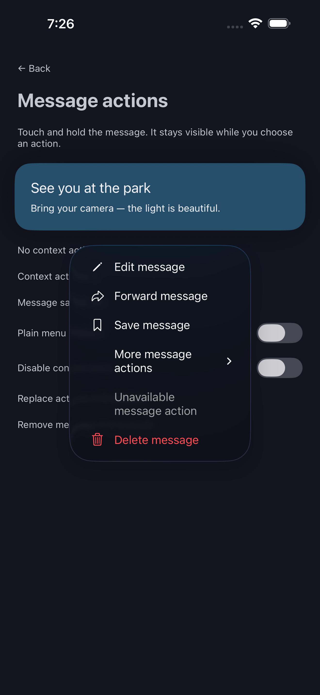
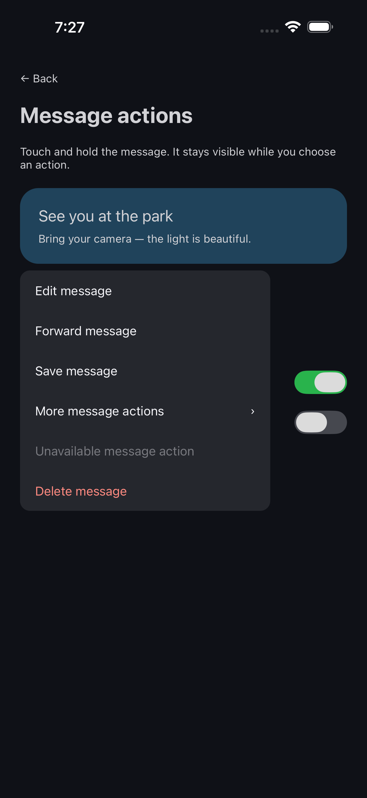

# Native menu buttons

`GlassMenuButton` presents a system menu from a native button. iOS 26 uses `UIButton.Configuration.glass()` and `UIMenu`; older iOS, Reduce Transparency, and `forceFallback` use a standard tinted UIKit button. Android uses `android.widget.Button` and the package's menu popup (see [Android menu appearance](#android-menu-appearance)). No Expo or extra glass layer is required.

```tsx
import {useState} from 'react';
import {GlassMenuButton} from '@likith99/react-native-adaptive-liquid-glass';

export function LibraryMenu() {
  const [favorite, setFavorite] = useState(false);
  return <GlassMenuButton
    title="Library actions"
    systemImage="ellipsis.circle"
    items={[
      {id: 'favorite', title: 'Favorite', systemImage: 'heart', checked: favorite},
      {id: 'share', title: 'Share', systemImage: 'square.and.arrow.up'},
      {id: 'unavailable', title: 'Unavailable', disabled: true},
      {id: 'remove', title: 'Remove', systemImage: 'trash', destructive: true},
    ]}
    onAction={id => {
      if (id === 'favorite') setFavorite(value => !value);
      // Handle other action IDs in your app.
    }}
  />;
}
```

The title and item IDs/titles must be nonempty, and IDs must be unique. Empty items disable the button. `disabled` blocks menu activation; item-level `disabled` keeps a visible unavailable entry. `checked` is controlled: the package emits the ID and your app updates the item. Leaving `checked` absent omits Android's checkbox. `destructive` marks the native action visually; selecting it only calls `onAction`. It does not perform a deletion.

`systemImage` is an iOS SF Symbol name, on both the trigger and individual items. Android displays the titles. `tintColor` changes the foreground accent; it does not recolor the menu material or apply the action cluster's neutral tint. Android applies it to enabled action text as well as the trigger; destructive actions retain the platform error color. `forceFallback` previews a standard iOS button while retaining the native menu. Android always uses its standard control. The system manages presentation and dismissal; controlled open state is not exposed.

## Sections and submenus

Existing flat `GlassMenuItem` actions remain compatible. `GlassMenuElement` adds two group types:

```tsx
const items: readonly GlassMenuElement[] = [
  {kind: 'submenu', id: 'sort', title: 'Sort', items: [
    {kind: 'section', id: 'order', title: 'Order', items: [
      {id: 'name', title: 'By name', checked: true},
      {id: 'recent', title: 'Most recent', checked: false},
    ]},
  ]},
];
```

Import the type from the package. Submenus require a title; sections can use an empty title for an untitled group. Every group must contain items. IDs must be unique across the complete tree, including group IDs. Only leaf action IDs produce callbacks. A disabled submenu blocks every descendant; its ID does not become an action.

The shared API supports one submenu level, up to 8 total tree levels including sections, and 256 elements. Submenus inside other submenus are rejected because Android's public SubMenu contract does not support them. UIKit renders sections inline; Android uses groups and disabled title rows, with native dividers on API 28+. Section title rows never emit actions. Groups can also be used in [toolbar menus](toolbars.md).

The default host height is 64 points with a 120-point minimum width. Set explicit width or flex in horizontal layouts and allow more room for long titles or large accessibility text. Native accessibility exposes the button label/hint, disabled items, and checkmarks. Use `accessibilityLabel`, `accessibilityHint`, and `testID` for the native trigger.

Native hosts dismiss an open menu when items change, the button becomes disabled, or the view detaches. Version checks reject stale selections, and the React wrapper also rejects unknown or disabled IDs. Unchanged items do not rebuild the menu. These controls do not participate in neighboring glass merging.

Rebuild both native applications after upgrading to a package containing this component. Fabric codegen and autolinking register `ALGMenu` alongside the existing slider on Android and the other iOS hosts. The demo's **Native menus** section exercises checked items, disabled entries, destructive appearance, and standard-button preview.

Implementation references: [Apple menu buttons](https://developer.apple.com/documentation/uikit/uicontrol/showsmenuasprimaryaction), [Android PopupMenu](https://developer.android.com/reference/android/widget/PopupMenu), [Android SubMenu limitations](https://developer.android.com/reference/android/view/SubMenu).

## Icon-only buttons (0.1.3)

`GlassIconButton` is a round, symbol-only control, such as a back, close or `⋯` button over content. With `onPress` it is a plain button; with `menu` it opens a native menu. Pass exactly one of them.

```tsx
import {GlassIconButton} from '@likith99/react-native-adaptive-liquid-glass';

<GlassIconButton systemImage="xmark" accessibilityLabel="Close" onPress={close} />
<GlassIconButton systemImage="ellipsis" accessibilityLabel="More options" size={40} colorScheme="dark"
  menu={{items: [{id: 'share', title: 'Share'}], onAction: handle}} />
```

- **iOS 26:** `UIButton.Configuration.glass()` with capsule corners in a square frame, which draws a circle. UIKit owns the press highlight and the menu morph.
- **Older iOS, Reduce Transparency and `forceFallback`:** the standard `.gray()` style.
- **Android:** an oval surface with a ripple and the `androidIcon` drawable, opening the menu popup.
- **Props:** `size` is the diameter (default 44 points, the minimum recommended touch target). `symbolPointSize` defaults to 40% of it. `colorScheme` (`system`, `light`, `dark`) pins the material, for example dark glass over a photo in both themes. `tintColor` colours the glyph.
- **Accessibility:** `accessibilityLabel` is required because the control shows no text.
- **Floating action button:** `variant="prominent"` fills the button with `tintColor` and draws the glyph in white: prominent glass on iOS 26, a filled button below it, and a filled oval on Android.

```tsx
<GlassIconButton systemImage="plus" androidIcon="ic_add" accessibilityLabel="Add item" size={56}
  variant="prominent" tintColor="#6159B7" onPress={add} />
```

## Opening a menu from code, and open/close events

`GlassMenuButton` and `GlassIconButton` accept `onOpen` and `onClose`. `onClose` fires after UIKit's closing animation, whether or not an action was chosen. Their `ref` is a `GlassMenuHandle`: the host view's `measure`, `measureInWindow`, `measureLayout`, `focus` and `blur`, plus `open()`.

```tsx
const menu = useRef<GlassMenuHandle>(null);
<GlassIconButton ref={menu} systemImage="ellipsis" accessibilityLabel="More" menu={{items, onAction}}
  onOpen={() => setOpen(true)} onClose={() => setOpen(false)} />
menu.current?.open();
```

`open()` uses `UIButton.performPrimaryAction()` on iOS 17.4 and later and shows the menu popup on Android. It does nothing on older iOS, while disabled, without items, or before the button is on screen. The system decides where the menu appears, so do not use it for precisely placed menus. The events are typed callbacks, not reserved action IDs.

## Verification

The preceding flat-menu revision passed TypeScript checks, 19 JavaScript tests, and native UI tests on the iOS simulator, physical iPhone, and Android emulator. The earlier physical-iPhone result does not cover these additions. After building and opening a fresh Android demo, reproduce the flat regression with `python3 scripts/verify-android-menu.py`, or the consolidated batch with `python3 scripts/verify-android-toolbar.py`. Metro uses port 8093. Older iOS runtime testing and full VoiceOver/TalkBack review remain outstanding.

## Menu panel: a menu you place yourself (0.1.5)

`GlassMenuPanel` is the system menu as a view: native rows on the iOS 26 glass platter, laid out by
React Native like any other view and never presented by the system. You decide where it goes, for
example always directly under a pressed message, moving the message up when there is no room.
`GlassLongPress` opens it from a long press, and the finger that pressed can slide straight onto a row.

```tsx
import {GlassLongPress, GlassMenuPanel, type GlassMenuElement} from '@likith99/react-native-adaptive-liquid-glass';

const actions: GlassMenuElement[] = [
  {id: 'forward', title: 'Forward', systemImage: 'arrowshape.turn.up.right', androidIcon: 'ic_forward'},
  {id: 'copy', title: 'Copy', systemImage: 'doc.on.doc', androidIcon: 'ic_copy'},
  {kind: 'section', id: 'more', title: '', items: [
    {id: 'delete', title: 'Delete', systemImage: 'trash', androidIcon: 'ic_delete', destructive: true},
  ]},
];
// Known before the panel draws, so the message can be placed in the same frame.
const menuHeight = GlassMenuPanel.measure(actions);

<GlassLongPress minimumDuration={350} haptic="medium" disabled={selecting}
  onLongPress={({frame}) => openMenuFor(message, frame)}>   {/* frame: window points */}
  <MessageBubble message={message} />
</GlassLongPress>

{menu && (
  <GlassMenuPanel ref={panel} items={actions} appearFrom="top" autoFocus accessibilityModal
    style={{position: 'absolute', left: menu.x, top: menu.y}}
    onAction={id => { handle(id); closeMenu(); }}
    onRequestClose={closeMenu} />
)}
```

**Look.** iOS 26: the glass platter with interactive glass, 250 pt wide, 40 pt rows, 21 pt across a
section separator, the SF Symbol leading and a checkmark trailing, as UIKit's own menu (measured on
iOS 26.5). The material is final from the first frame; it does not brighten after appearing.
Destructive rows are red and disabled rows dimmed; titles follow Dynamic Type. Below iOS 26 and under
Reduce Transparency: the system material (or an opaque surface) with a shadow. Android: the Material
popup look from `androidMenuStyle` (corner radius and light/dark colours), with ripples. `colorScheme`
(`'system' | 'light' | 'dark'`) follows your app's theme rather than the system's.

**Items.** The same tree as the other menus: actions, titled or untitled sections, `checked`,
`destructive`, `disabled`, `systemImage`, `androidIcon`. Submenus are not supported in a panel
(it throws); use sections. `onAction` receives only enabled items.

**Touch.** Touching a row highlights it; sliding moves the highlight with a selection tick on each
new row (`UISelectionFeedbackGenerator` on iOS, a clock tick on Android); lifting on an enabled row
calls `onAction`. Lifting elsewhere, or on a disabled row, calls `onCancelTouch` if given. The panel
does not cancel React Native's touches, and is not cancelled by them. When content is taller than
`maxHeight` the rows scroll natively; once they scroll, the touch no longer selects.

**Layout.** `width` is a number or `'intrinsic'` (default, the system menu width). The height comes
from the items: `GlassMenuPanel.measure(items, {width, maxHeight, fontScale})` returns it
synchronously and the panel uses the same value, so nothing jumps. `fontScale` defaults to the
current text size. The panel renders correctly under transformed ancestors; do not fade it with
`opacity` on iOS, because glass does not render inside a fading view (`appearFrom` animates with
transforms only).

**Motion.** `appearFrom="top" | "bottom"` springs the panel in from that edge when it mounts
(`'none'` by default; skipped under Reduce Motion or with Android animations off). The ref's
`dismiss()` animates it out and then calls `onDismissed`; unmount it there.

**Accessibility.** Each row is a button element labelled by its title; destructive rows say so,
disabled rows are disabled, and VoiceOver or TalkBack can activate them. `autoFocus` moves the
screen reader to the first row when the panel appears; `accessibilityModal` makes it the only
thing VoiceOver reads (on Android it becomes an accessibility pane). VoiceOver's escape gesture
calls `onRequestClose`.

**Dismissal is yours.** The panel does not close itself, dim the screen or handle Android Back. Put
it in your own overlay, for example a full-screen `Pressable` that closes it on an outside tap.

### `GlassLongPress`

Wraps any content and recognises a native long press (`minimumDuration` in ms, default 500;
`allowableMovement` in points, default 10; `disabled`; `haptic`: `'none' | 'light' | 'medium' |
'heavy' | 'soft' | 'rigid'`, Android uses its standard long-press haptic for any value except none).

- Before it is recognised it stays out of the way: the children's `onPress`, an enclosing list's
  scroll and gesture-handler pans keep working, and moving further than `allowableMovement` fails it.
- On recognition `onLongPress({frame})` reports the wrapper's frame in window points, measured
  natively, and the children's touches are cancelled, so they do not fire `onPress` on release.
- While the finger stays down, its movement and release go to the most recently mounted
  `GlassMenuPanel`. If the panel is not mounted yet, the latest point is kept and applied when it
  mounts. Lifting on a row chooses it; lifting anywhere else leaves the panel open for a tap.

## Android menu appearance

On Android, menu buttons, icon buttons and context menus open a Material 3-style popup: a rounded
surface with an icon beside each item, checkmarks and a submenu arrow, section titles and dividers.
Submenus open in place with a back row. The popup sits below its button or content, aligned to the
nearer screen edge, and moves above when there is no room below. iOS menus are drawn by UIKit and
keep the system appearance.

Give items an `androidIcon` (a drawable resource name) to show icons; rows without one keep their
titles aligned with the rest. `androidMenuStyle` changes the shape and colours, for both
appearances:

```tsx
<GlassContextMenu items={[
    {id: 'forward', title: 'Forward', androidIcon: 'ic_forward'},
    {id: 'delete', title: 'Delete', androidIcon: 'ic_delete', destructive: true},
  ]}
  onAction={handle}
  androidMenuStyle={{
    cornerRadius: 24,
    backgroundColor: {light: '#FFFFFF', dark: '#1A1B20'},
    textColor: {light: '#1B1B1F', dark: '#E3E3E8'},
    iconColor: '#8E8E93',               // one colour for both appearances
    destructiveColor: {light: '#BA1A1A', dark: '#FFB4AB'},
  }}>
  <Message />
</GlassContextMenu>
```

| Style key | Default (light / dark) |
| --- | --- |
| `cornerRadius` | 16 dp |
| `backgroundColor` | `#FFFFFF` / `#1A1B20` |
| `textColor` | `#1B1B1F` / `#E3E3E8` |
| `iconColor` | `#46464F` / `#B9BAC2` |
| `destructiveColor` | `#BA1A1A` / `#FFB4AB` |

Colours are static values. The appearance follows the system, or the control's `colorScheme`
where it has one. `GlassMenuButton` and `GlassIconButton` take the same `androidMenuStyle`. The
toolbar's overflow menu keeps Android's toolbar menu.

## Long-press content menus (0.1.3)

<table><tr>
<td><br>Native iOS</td>
<td><br>Plain fallback, previewed on iOS</td>
</tr></table>

`GlassContextMenu` wraps a message, image, or other noninteractive content:

```tsx
import {Text, View} from 'react-native';
import {GlassContextMenu} from '@likith99/react-native-adaptive-liquid-glass';

<GlassContextMenu accessibilityLabel="Message from Alex"
  previewCornerRadius={20}
  items={[
    {id: 'edit', title: 'Edit', systemImage: 'pencil'},
    {id: 'forward', title: 'Forward', systemImage: 'arrowshape.turn.up.right'},
    {id: 'delete', title: 'Delete', systemImage: 'trash', destructive: true},
  ]}
  onAction={id => handleMessageAction(id)}>
  <View style={{padding: 20, borderRadius: 20, backgroundColor: '#D9EAF7'}}>
    <Text>See you at the park</Text>
  </View>
</GlassContextMenu>
```

On iOS, a native `UIContextMenuInteraction` lifts a preview of the wrapped content
and presents the actions alongside it. The message remains visible in the preview
and returns to its original layout on dismissal. iOS 26 uses the system's current
menu appearance; older supported iOS versions use their standard context menu.
Android opens the menu popup below the content on long press and leaves the content in
place. It does not reproduce the iOS lift animation. Placement is system controlled:
menus can appear above the content when space below is limited.

`items`, `onAction`, sections, submenus, checkmarks and disabled/destructive actions
follow the same contract as `GlassMenuButton`. A regular tap does not open the menu.
`disabled` or empty items suppress it. Replacing items, disabling or unmounting the
wrapper dismisses the menu; obsolete native actions cannot fire. `onAction` only
reports a selection: edit/delete/forward behavior belongs to your application.

The wrapper sizes from its React children and accepts normal View layout props.
Use a single noninteractive content root for a coherent preview; nested buttons,
selectable text and scrolling controls own their gestures and can compete with long
press. `previewCornerRadius` (default 16, finite and nonnegative) shapes only the iOS
preview outline; style your child's background and corners separately.
`previewCornerRadii={{topLeft, topRight, bottomLeft, bottomRight}}` (0.1.5) sets corners
individually, for example a grouped bubble's tight corner; a corner left out uses
`previewCornerRadius`. `onOpen` and `onClose` (0.1.5) report the menu appearing and, after its
dismissal animation, going away, on iOS, Android and the plain fallback. No custom
press physics, merging, trigger replacement, or forced menu-material tint is added.
The existing `GlassMenuButton` keeps its tap presentation.

Set a meaningful `accessibilityLabel` on the wrapper to expose the content as one
target; iOS also exposes enabled leaf actions as accessibility custom actions.
Android exposes native long-click. Native menus own menu-item focus and settings
adaptation. Spoken VoiceOver/TalkBack testing remains separate from automated tests.
Rebuild both native apps after upgrading; this feature extends the Fabric spec.

### Plain menu fallback preview

Set `forceFallback` on `GlassContextMenu` to use the same plain anchored React Native
popup on iOS or Android. The original content stays in place, with no lifting or
glass transition. It supports the same action tree, disabled/destructive items,
controlled checkmarks, submenus, outside-tap dismissal and Android back dismissal.
The popup chooses below or above its anchor and scrolls when space is limited.
Changing items, disabling, rotating, resizing or unmounting dismisses it.

The example's **Message actions → Plain menu fallback** switch lets you inspect
this behavior on an iOS simulator. This previews the shared fallback interaction;
it does not emulate or verify Android's native PopupMenu renderer. With
`forceFallback={false}` (the default), each platform still uses its native menu.
